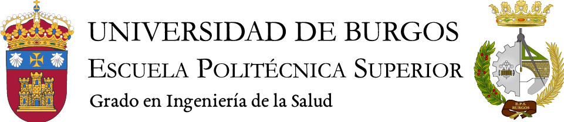

# Programa para pacientes con dificultades en el ámbito de expresión oral
Desarrollo de herramientas para la ayuda de niños o niñas con problemas de expresión oral.

## Alumnos
- Anna Lázaro: alc1020@alu.ubu.es
- Minaya Moreno: mmr1047@alu.ubu.es
- Miguel Soriano: mse1003@alu.ubu.es
- Andrés Arribas: aaa1041@alu.ubu.es
- Diego Vallina: dva1004@alu.ubu.es

## Introducción

## trabajo
-hacer un mockup (una demo muy sencilla en una pagina de como quedaria el proyecto)
-hacer el trabajo en un word/presentacion 
-coger pictogramas de ejemplo de araasac